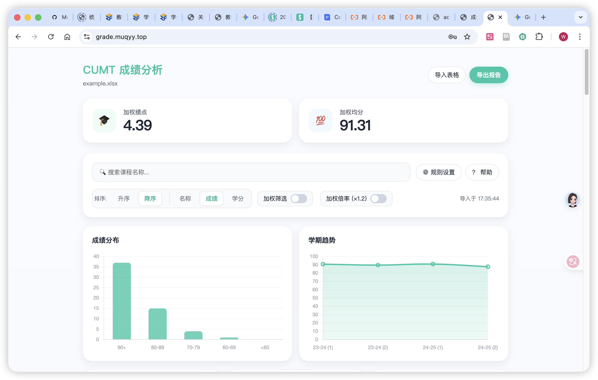
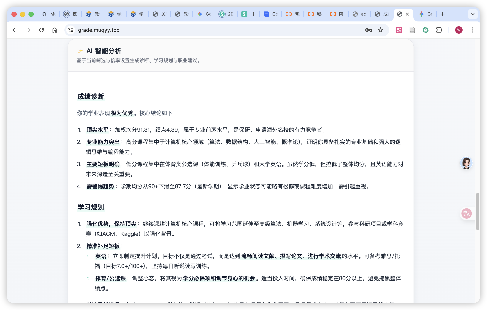
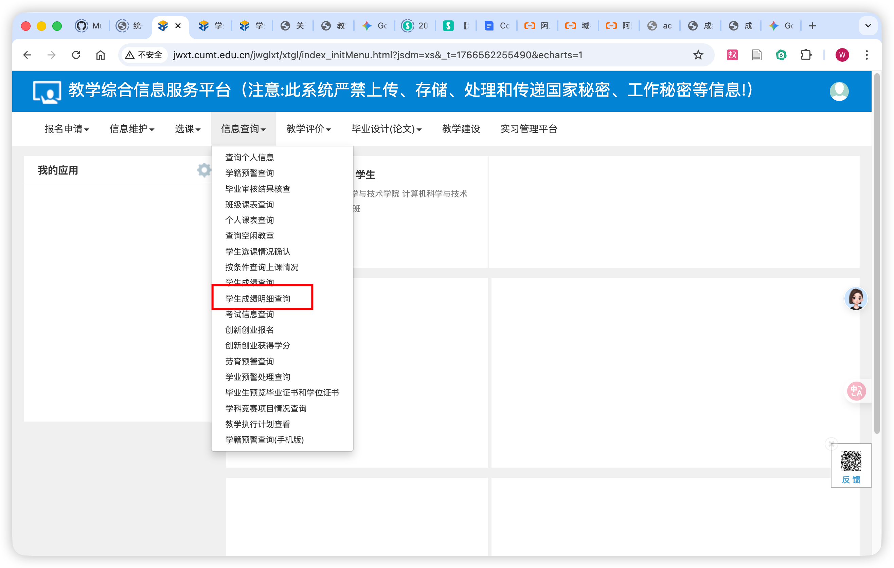
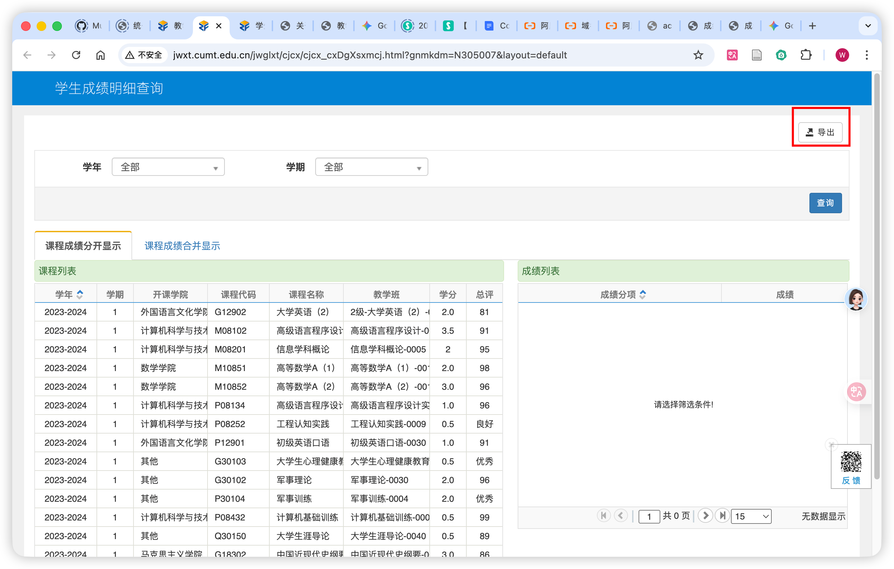
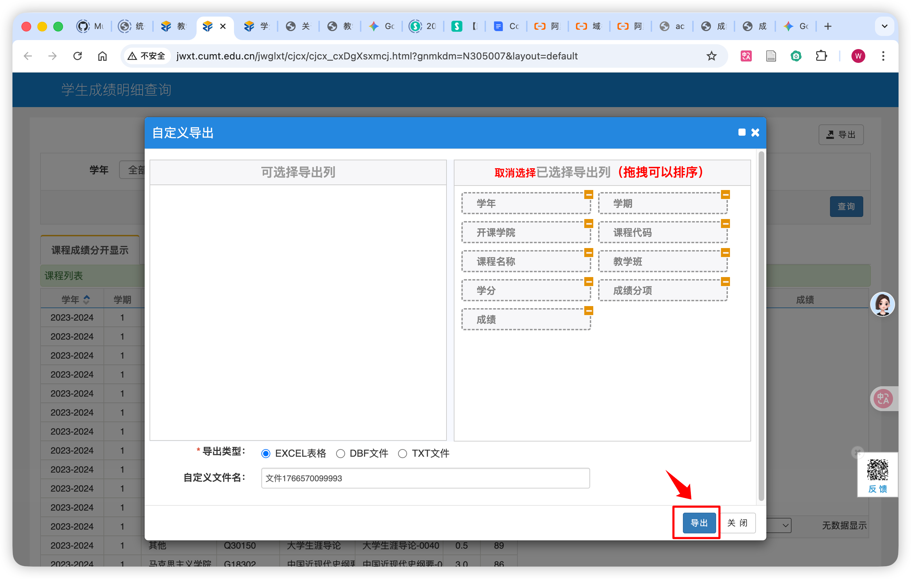

<div align="center">
  <h1>🎓 CUMT Grade Calculator</h1>
  <p>
    <strong>中国矿业大学成绩分析工具</strong>
  </p>
  <p>
    加权计算 / 智能诊断 / 可视化分析 / 报告导出
  </p>

  <!-- Badges -->
  <p>
    <a href="https://github.com/MuQY1818/CUMT_Grade_Calculator/blob/main/LICENSE">
      
    </a>
    <a href="https://grade.muqyy.top/">
      
    </a>
    
    
  </p>

  <p>
    <a href="https://grade.muqyy.top/">🚀 在线使用</a> · 
    <a href="#-快速开始">📦 快速开始</a> · 
    <a href="#-功能特性">✨ 功能特性</a> · 
    <a href="#-问题反馈">🐛 问题反馈</a>
  </p>
</div>

<br />

## 📖 项目简介

**CUMT Grade Calculator** 是一款专为中国矿业大学学生设计的成绩分析工具。它不仅支持从教务系统导出的 Excel 成绩单，还能根据学校的推免/保研计算规则（如 ×1.2 倍率、首次不及格处理等）进行精确的加权绩点计算。

此外，集成了 **SiliconFlow AI**，为您提供深度的成绩诊断、学习规划与职业发展建议，助您从容应对学业挑战。

---

## 📸 界面预览

| 📊 核心数据看板 | 🤖 AI 智能分析 |
|:---:|:---:|
|  |  |

> 💡 **提示**：支持导出精美的 PDF 成绩报告，方便存档或打印。

---

## ✨ 功能特性

- **📊 智能导入**：一键上传 `.xlsx` 成绩单，自动识别课程、学分与成绩。
- **⚙️ 灵活规则**：
    - ✅ **加权倍率**：自动/手动标记 ×1.2 公共课。
    - ✅ **特殊课程**：支持通识公选课、拓展课程组的筛选与剔除。
    - ✅ **重修处理**：首次不及格课程按 60 分/1.0 绩点计算。
- **📊 可视化图表**：
    - 成绩分布直方图
    - 学期均分趋势折线图
- **🤖 AI 深度诊断**：
    - 基于成绩数据的个性化 SWOT 分析。
    - 生成学习计划、时间管理建议与职业规划。
- **📤 专业报告**：支持生成并导出包含图表与详细数据的 PDF/PNG 报告。

---

## 🛠️ 技术栈


---

## 🚀 快速开始

### 环境要求

- **Node.js**: >= 18.0.0
- **pnpm** / **npm** / **yarn**

### 本地部署

1. **克隆仓库**

   ```bash
   git clone https://github.com/MuQY1818/CUMT_Grade_Calculator.git
   cd CUMT_Grade_Calculator
   ```

2. **安装依赖**

   ```bash
   npm install
   # 或者
   pnpm install
   ```

3. **启动开发服务器**

   ```bash
   npm run dev
   ```
   
   访问 `http://localhost:5173` 即可使用。

4. **构建生产版本**

   ```bash
   npm run build
   ```

---

## 📖 使用指南

### 1. 获取成绩单
登录教务系统，按照以下步骤导出成绩单：

| Step 1 | Step 2 | Step 3 |
|:---:|:---:|:---:|
|  |  |  |

### 2. 导入与设置
- 点击首页 **「导入表格」**，选择下载的 Excel 文件。
- 点击 **「规则设置」**，根据实际情况开启/关闭加权规则（如 ×1.2、拓展课排除等）。

### 3. AI 分析
- 在右下角 AI 面板输入您的 **SiliconFlow API Key**。
- 点击 **「开始分析」**，等待 AI 生成专属报告。

### 📋 文件格式说明

如果您手动制作 Excel，请确保包含以下列（表头不区分大小写）：

| 列名 | 说明 | 示例 |
|:---|:---|:---|
| **学年** | 课程所属学年 | `2023-2024` |
| **学期** | 课程所属学期 | `1` 或 `2` |
| **课程名称** | 课程全称 | `高等数学A(1)` |
| **学分** | 课程学分 | `5.0` |
| **总评** | 最终成绩 | `95` 或 `优秀` |
| **分项名称** | (可选) 如平时、期中 | `平时` |
| **分项成绩** | (可选) 各分项分数 | `90` |
| **分项权重** | (可选) 各分项占比 | `30%` |

---

## 📂 项目结构

```text
src/
├── 📄 App.jsx              # 主应用逻辑
├── 📄 main.jsx             # 入口文件
├── 📂 components/          # UI 组件
│   └── 📊 Charts.jsx       # 图表组件
├── 📂 utils/               # 工具函数
│   ├── 📝 excel.js         # Excel 解析器
│   ├── 🧮 grade.js         # 核心计算算法
│   ├── 📤 export.js        # 导出 PDF/图片
│   └── 🔧 constants.js     # 常量配置
└── 🎨 styles.css           # 全局样式
```

---

## 📄 开源协议

本项目采用 [MIT License](LICENSE) 开源。

---

<div align="center">
  <p>Made with ❤️ by Weijue</p>
</div>
